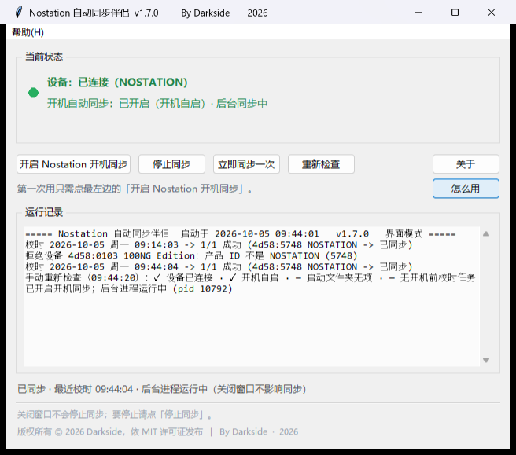
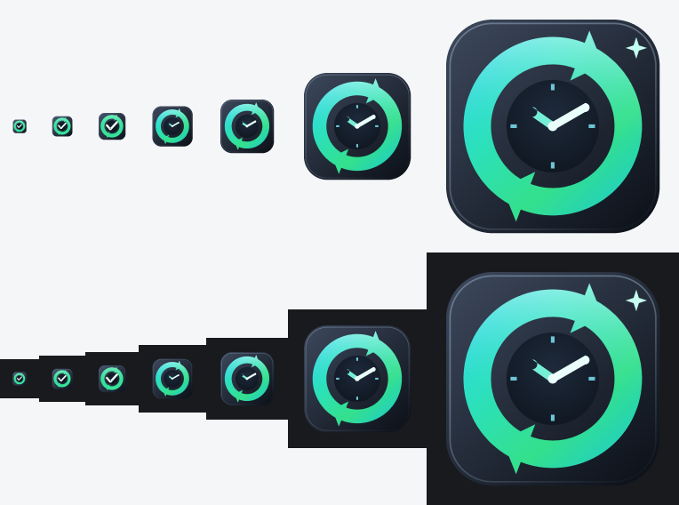

# Nostation 自动同步伴侣

> **Nostation Auto Sync Companion** — 让 Matrix Lab NOSTATION 的 hub 时间在每次开机时自动校准，不用再手动打开网页。

<p>
  
  
  
  
  
  
</p>

---

## 这是什么

Matrix Lab 的 **NOSTATION** hub 带一块屏幕，时间需要手动同步——官方做法是每次开机打开
`https://config.matrix-lab.com/` 网页点一下同步。

这个小工具把那件事变成**自动**的：装一次，之后每次开机它都在后台静默把 hub 时间校准到本机时间。
单文件绿色版，免安装，双击即用。

## 界面



打开程序后看到的就是这一屏（真实截图，Windows 11 / 175% 缩放）。

### 第一次用，只需要点一个按钮

插好 NOSTATION hub，点 **「开启 Nostation 开机同步」**，就完事了。
以后每次开机自动校时，不用再管它。

### 每个按钮是干什么的

| 按钮 | 作用 | 什么时候点 |
| --- | --- | --- |
| **开启 Nostation 开机同步** | 安装开机自启（写入当前用户启动项）并启动后台同步进程，**同时立刻校时一次** | 第一次用、或想重新开启时。点一次就够，重复点也没事 |
| **停止同步** | 清理**所有**自启项（注册表项、启动文件夹、计划任务）并结束后台进程，清理后逐项核验残留 | 想彻底关闭自动同步时。**设备没插着也能点** |
| **立即同步一次** | 马上把本机时间写入设备一次 | 刚开机还没触发自动同步，或想确认设备通不通 |
| **重新检查** | 重新核对五项状态并写进运行记录：设备 / 开机自启 / 启动文件夹 / 开机前任务 / 后台进程 | 手动改过自启、或觉得显示与实际不符时 |
| **怎么用** | 打开完整使用说明（按钮、指示灯、状态区、日志含义、常见问题） | 任何看不懂的时候 —— 也可从菜单 `帮助(H) → 怎么用` 打开 |

> **为什么「重新检查」点了好像没反应？**
> 早期版本它只刷界面文字、不写日志，状态正常时看起来就像没反应。
> 现在每次点都会在运行记录里写一行，例如：
>
> ```
> 手动重新检查（09:44:20）：✓ 设备已连接 · ✓ 开机自启 · — 启动文件夹无项
>                          · — 无开机前校时任务 · ✓ 后台同步运行中
> ```
>
> `✓` 正常、`✗` 有问题、`—` 表示该项本来就没设置。

### 状态区怎么看

- **左边小圆点** —— 绿 = 后台同步进程在跑，红 = 没在跑。
  注意它反映的是"同步程序在不在运行"，**不是**"设备插没插"。
- **设备** —— `已连接（NOSTATION）` 或 `未检测到 NOSTATION（请检查 USB 连接）`
- **开机自动同步** —— `已开启（开机自启）· 后台同步中` / `未开启` /
  `路径已失效`（程序被挪过位置，运行一次会自动修正）

### 按钮为什么会变灰

没检测到 NOSTATION 时，「开启开机同步」和「立即同步一次」会**自动置灰**、点不动 ——
这是故意的，防止误操作。插好设备后 3 秒内自动恢复，也可点「重新检查」立即恢复。

**「停止同步」任何时候都能点**：设备拔了、收起来了，你仍然要能关掉开机自启。

### 运行记录里的「拒绝设备」是正常的

如果你机器上还有别的 Matrix Lab 设备，程序会检查它、发现不是 NOSTATION 就拒绝操作，
并记录一行，例如：

```
拒绝设备 4d58:0103 100NG Edition：产品 ID 不是 NOSTATION (5748)
```

这是**正常现象**，也是"本程序只动 NOSTATION 这一台"的证明。
同一台设备每次运行只记一条，不会刷屏。

## 应用图标



*图标覆盖 16 / 24 / 32 / 48 / 64 / 128 / 256 全部尺寸，上排浅色背景、下排深色背景。
16~32px 用简化的「环 + 勾」保证可辨识，48px 以上用完整的「同步环 + 表盘 + 指针」。*

## 功能

| 功能 | 说明 |
| --- | --- |
| **开机自动同步** | 写入注册表启动项，开机后自动在后台校准 hub 时间 |
| **无需常驻界面** | 关闭窗口不影响同步；后台进程独立运行 |
| **一键停止并清理** | 「停止同步」会清理注册表、启动文件夹、计划任务、后台进程，并**核验无残留** |
| **只认这一台设备** | 四重准入校验，其它任何 HID 设备都无法被本程序操作 |
| **随处可用** | exe 挪到任何路径（甚至改名）后，会自动修正启动项指向，不用重新设置 |
| **单文件绿色版** | 就一个 exe，图标与启动画面已内嵌，拷给别人也不会丢 |
| **启动日志** | 每次打开都是全新日志，记录本次会话的校时结果 |

## 快速开始

### 直接使用（推荐）

1. 到 [Releases](../../releases) 下载 `Nostation.exe`（单文件绿色版，免安装）
   - GitHub 的下载附件名只支持 ASCII 字符，所以附件叫 `Nostation.exe`；
     想恢复中文文件名的话，下载后重命名为 `Nostation自动同步伴侣.exe` 即可，功能完全相同
2. 放到任意位置（桌面即可），双击运行
3. 首次运行阅读并同意许可条款
4. 插好 NOSTATION hub，点 **「开启 Nostation 开机同步」**

看到状态灯变绿、显示「已同步」就完成了。之后每次开机都会自动校时。

### 停止使用

点 **「停止同步」** 即可。它会清理所有启动项并核验残留，
不会再有任何后台进程或自启项。

## 工作原理

### 时钟同步协议

协议是从 `config.matrix-lab.com` 的 Vial Web 前端里逆出来的。设备通过
**raw HID**（`usage_page = 0xFF60`、`usage = 0x61`）接收命令，报文格式：

| 字段 | 长度 | 值 |
| --- | --- | --- |
| 前缀 | 1 | `0xFD`（AMK 指令） |
| 命令 | 1 | `0x37`（设置日期时间） |
| 年高位 | 1 | `year >> 8` |
| 年低位 | 1 | `year & 0xFF` |
| 月 / 日 / 星期 / 时 / 分 / 秒 | 各 1 | BCD 无关，直接数值 |
| 补齐 | 到 32 字节 | `0x00` |

设备成功应答为 `FD 37 AA`。

相关常量：

```
AMK_PREFIX        = 0xFD
AMK_SET_DATETIME  = 0x37
AMK_GET_AUX_MODE  = 0x3A    # 只读指纹，用于确认设备身份
AMK_OK            = 0xAA
VIA_PREFIX        = 0xFE    # 本固件不支持读 Vial 定义（返回 08 07 ...）
```

> 注：这台 NOSTATION 的固件**不支持** Vial 的 `GET_SIZE(0xFE 0x01)` /
> `GET_DEFINITION(0xFE 0x02)` 命令，所以无法靠读取键盘定义来确认身份，
> 改为使用 AMK 只读指纹命令 `0x3A` 做准入判断。

### 设备准入（为什么只有 NOSTATION 能用）

`admit_device()` 是**唯一**的准入判断，同步、状态检测、后台巡查全部走它，
代码里不存在任何跳过校验的旁路。四重校验：

1. 厂商 ID 必须是 Matrix Lab（`0x4D58`）
2. 产品 ID 必须是 NOSTATION（`0x5748`）— **精确匹配，不做任何回退**
3. 产品名必须包含 `NOSTATION`
4. 必须应答 AMK 指纹命令 `0x3A`，且返回值在 `0..8` 范围内

任一条不满足即拒绝，并在日志里记录一条（同一设备每次运行只记一次，避免刷屏）。

### 路径自愈

程序启动时会比对「注册表里记录的路径」与「当前实际运行的路径」，
不一致就改过来，并提示用户。所以 exe 换盘、换目录、改名之后，
开机自启依然指向正确位置，不需要重新设置。

### 图标不会丢

图标写进两处，缺一不可：

| 位置 | 作用 |
| --- | --- |
| exe 资源（PyInstaller `--icon`） | 资源管理器 / 桌面显示 |
| **exe 内部归档（`--add-data`）** | 运行时读取，决定**窗口标题栏与任务栏**图标 |

只做前者的话，exe 一挪位置或发给他人都不会变丑，但**窗口图标会退回 Python 默认图标**。
运行时会把图标里最大的一帧画成合适尺寸，再用 Win32 `WM_SETICON` 设置
（按 `SM_CXICON` 取尺寸，高 DPI 下的标题栏也不会模糊）。

## 从源码构建

需要 Windows + Python 3.10 以上（实测 3.12），然后安装依赖：

```powershell
pip install -r requirements.txt
```

打包：

```powershell
.\build_exe.ps1
```

脚本会自动：**探测 Python** → 生成版本资源 → 生成启动画面 → 打包单文件 exe →
用 `--status --no-heal` 做一次自检。产物在 `dist\`。

**Python 不需要手动指定**：脚本按
`NOSTATION_PYTHON` 环境变量 → `PATH` → `py` 启动器 → 注册表 → 常见安装目录
的顺序查找，并会跳过 Microsoft Store 的 `python.exe` 占位存根。
想指定特定解释器就用环境变量，不要改脚本：

```powershell
$env:NOSTATION_PYTHON = "D:\Python312\python.exe"
.\build_exe.ps1
```

> 版本号与更新记录在 [`companion_app.py`](companion_app.py) 顶部的
> `APP_VERSION` / `APP_BUILD` / `CHANGELOG`，打包时会同步写进 exe 属性。
> 发版流程与几条容易踩的坑（PowerShell 编码、绝对路径、条款版本号）
> 都记在 [`RELEASING.md`](RELEASING.md) 里。

## 命令行参数

不常用，但排错时很有用（exe 无控制台，配合 `--out` 写文件）：

| 参数 | 说明 |
| --- | --- |
| （无） | 打开图形界面 |
| `--watch` | 后台同步模式（开机自启用的就是它） |
| `--sync-now` | 立即同步一次后退出 |
| `--status --out 文件` | 把当前状态写入文件（自检用） |
| `--no-heal` | 本次不做位置自愈 |
| `--show-license` | 只看许可条款对话框 |
| `--version` / `--help` | 版本 / 帮助 |

## 项目结构

```
nostation-hub-sync/
├── companion_app.py          # 主程序（界面 + 协议 + 后台巡查 + 许可）
├── build_exe.ps1             # 一键打包（自动探测 Python）
├── resolve_python.ps1        # Python 解释器探测（多个脚本共用）
├── requirements.txt          # Python 依赖
├── make_icon.py              # 应用图标生成器
├── make_splash.py            # 启动画面生成器
├── make_window_icon.py       # 构建时预生成窗口图标（免去运行时依赖 Pillow）
├── generate_version_info.py  # 生成 exe 的版本资源
├── LICENSE                   # MIT 许可证
├── LICENSE_TERMS.txt         # 许可条款纯文本（与程序内一致）
├── NOTICE.md                 # 许可中文说明
├── RELEASING.md              # 发版流程备忘（打包、发布、注意事项）
├── assets/                   # 图标、启动画面与界面截图
│   ├── companion.ico
│   ├── icon-preview.png
│   ├── splash.png
│   └── ui-preview.png
├── tools/                    # 诊断与校验工具
│   ├── verify_icon.py        # 校验 ICO（逐帧解码，绕开 Pillow 的取帧缺陷）
│   ├── check_exe_icon.py     # 校验 exe 内嵌图标与源文件一致
│   ├── make_ui_screenshot.py # 用 PrintWindow 抓取界面截图（可复现）
│   ├── amk_probe.py          # AMK 协议探测
│   └── vial_definition.py    # Vial 定义读取尝试
├── scripts/                  # 辅助脚本
│   ├── put_on_desktop.ps1    # 把构建好的 exe 放到桌面
│   └── uninstall.ps1         # 手动卸载（一般用界面里的「停止同步」即可）
└── legacy/                   # 旧版（v1.1.x 脚本式安装，已被单文件版取代）
    ├── install.ps1 / make_portable.ps1 / move_to_fixed_dir.ps1
    └── nostation_sync.py / nostation_watcher.py / start-watcher.vbs
```

> `legacy/` 里的脚本保留只为参考：自 v1.2.0 起软件是单文件 exe，
> 安装、自启、迁移、清理都由软件自己做，这些脚本不再需要。

## 数据文件

所有运行数据都在 `%LOCALAPPDATA%\NostationSync\`：

| 文件 | 内容 |
| --- | --- |
| `config.json` | 许可是否已同意、自启开关 |
| `nostation-sync.log` | 运行日志（每次打开清空） |
| `rejected-devices.json` | 被拒绝设备的去重记录 |
| `watcher.pid` | 后台进程锁 |
| `window-icon.ico` | 运行时生成的高清窗口图标 |

## 常见问题

**桌面图标换了但没变化？**
Windows 图标缓存的问题，不是打包问题。清缓存：

```powershell
ie4uinit.exe -show
```

还不行就删缓存并重启资源管理器：

```powershell
Stop-Process -Name explorer -Force
Remove-Item "$env:LOCALAPPDATA\Microsoft\Windows\Explorer\iconcache_*.db" -Force
Start-Process explorer
```

**杀毒软件报警？**
PyInstaller 打包的未签名 exe 常被误报，属常见现象。
代码全部开源在本仓库，可自行审阅并从源码构建。

**提示「未检测到连接」？**
确认 hub 已插好、能被 `config.matrix-lab.com` 正常识别。
按钮会变灰是预期行为——没检测到设备时不允许操作。
唯一例外是「停止同步」始终可用，避免设备不在时无法关闭自启。

**开机没自动同步？**
运行一次程序，用 `--status` 看 `registry` 与 `watcher` 两行：

```powershell
& ".\Nostation自动同步伴侣.exe" --status --out status.txt
Get-Content status.txt
```

## 说明

### 第三方工具声明（与 Matrix Lab 无关）

本项目是**独立的第三方工具**，由 Darkside 个人开发与维护。
作者与 Matrix Lab 及其关联公司**没有任何隶属、合作、赞助、授权或背书关系**。

- 「Matrix Lab」「NOSTATION」等名称与商标归各自权利人所有，本项目仅为说明兼容性而提及
- 本项目**不是** Matrix Lab 的官方软件，也未经其审核或认可
- 遇到问题请**勿向 Matrix Lab 寻求支持**，请在本仓库提 Issue

### 隐私

- 本软件**不上传任何数据**；只有「检查更新」会访问 GitHub 查版本号，且可关闭
- 不会改动按键映射、灯光设置或屏幕内容

> **如果这个软件帮到了你，欢迎点个 Star ⭐** —— 开源项目靠这个被人看到，
> 也是作者继续维护的动力。右上角就有 Star 按钮。

## 自动更新

程序启动约 3 秒后会**静默查询 GitHub 上的最新版本**。没有更新时完全不打扰你。

发现新版本时会弹窗告知版本号、下载大小和更新内容，并提供一键升级：

1. 下载新版（带进度条）
2. **校验 SHA256**，确认文件完整未被篡改
3. 自动替换旧 exe 并重新打开程序（约 3~10 秒）

你的开机自启设置、日志、配置都不受影响。

**关于自动替换的实现**：Windows 不允许程序覆盖自己正在运行的 exe，所以替换交给一个
独立的 PowerShell 小脚本完成 —— 它等主程序退出后覆盖文件、再把你重新拉起来。
过程记录在 `%LOCALAPPDATA%\NostationSync\self-update.log`。

### 手动检查与关闭自动检查

菜单 `帮助(H)` 里有三项：

| 菜单项 | 作用 |
| --- | --- |
| **检查更新** | 立刻手动检查一次，并可一键升级 |
| **版本历史** | 单独窗口，列出每个版本改了什么（不堆在「关于」里） |
| **启动时自动检查更新** | 可勾选的开关，不想要自动检查就取消勾选（仍可手动检查） |

### 隐私说明

**只有「检查更新」会访问网络**（GitHub 公开 API，用于获取版本号），再无其它联网行为，
且该行为**可以关闭**。校时功能始终只与本机 USB 设备通信。

## 许可

**本项目是开源软件，以 [MIT 许可证](LICENSE)发布。**

| | |
| --- | --- |
| 免费使用 | ✅ |
| 查看 / 修改源码 | ✅ |
| 制作衍生版本 | ✅ |
| 商业使用 | ✅ |
| 再分发（含修改版） | ✅ 需保留版权声明与许可声明 |
| 移除版权声明与作者署名 | ❌ |
| 以作者名义背书或作出承诺 | ❌ |

唯一的实质要求就是 MIT 本身那一条：**在所有副本或主要部分中保留版权声明与本许可声明**。

```
Copyright (c) 2026 Darkside
```

软件按"现状"提供，不附带任何担保。完整的英文许可正文见 [LICENSE](LICENSE)；中文通俗说明见 [NOTICE.md](NOTICE.md)。
软件内「关于」对话框与首次启动时的许可条款也包含同样的说明（[LICENSE_TERMS.txt](LICENSE_TERMS.txt)）。

## 参与贡献

欢迎提 Issue 和 Pull Request：

- **发现 bug** 或**有功能建议** → 开一个 [Issue](../../issues)
- **想改代码** → Fork 后提交 PR，说明改了什么、为什么改
- 涉及设备协议的改动，请附上你的设备型号与固件版本
- **觉得有用** → 点个 Star ⭐（对开源项目帮助很大）

## 致谢

感谢所有提出问题与改进建议的使用者。
